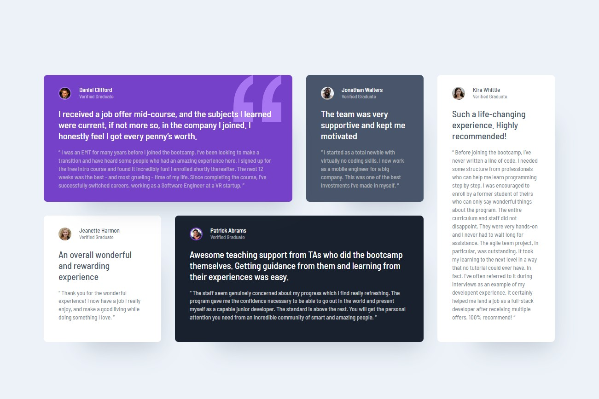

### Screenshot




## My process

### Built with

- Semantic HTML5 markup
- CSS custom properties
- Flexbox
- CSS Grid
- Mobile-first workflow

```html
  <main class="main">
    <div class="card grid-item-1">
```
```css
.main {
  padding: $size-71 $size-24;
  display: flex;
  flex-direction: column;
  gap: $size-24;

  @media (min-width: 768px) {
    display:grid;
    grid-template-columns: repeat(4, 1fr);
    grid-template-rows: repeat(2, 1fr);
    gap: $size-30;
    max-width: rem(1110px);
    padding: 0;
  }
}
```

## Author

- Frontend Mentor - [@frontend-en](https://www.frontendmentor.io/profile/frontend-en)